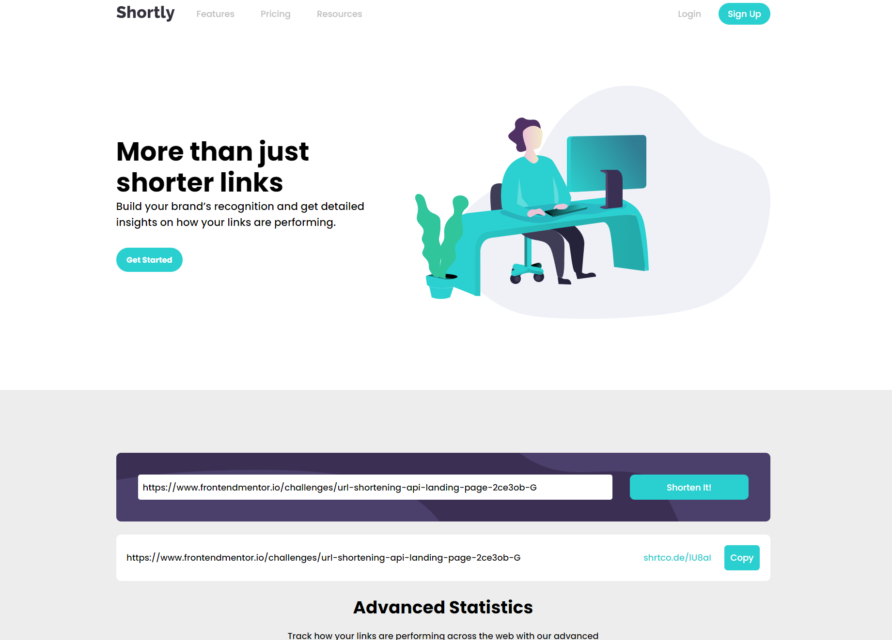

# Frontend Mentor - Shortly URL shortening API Challenge solution by dlxzeus777

## Welcome! 👋

## The challenge

Your users should be able to:

- View the optimal layout for the site depending on their device's screen size
- Shorten any valid URL
- See a list of their shortened links, even after refreshing the browser
- Copy the shortened link to their clipboard in a single click
- Receive an error message when the `form` is submitted if:
  - The `input` field is empty

## Built with:

- HTML5
- CSS
- CSS Grid
- CSS Flexbox
- JavaScript
- shrtcode API

## Difficulties:

- Setting the second section's background to grey. Main has a width: 75rem and max-width: 95%, so I created a div outside of main set the position to absolute and positioned it behind the 2nd section, but I feel like there's a so much better solution to this.
- First time using shrtcode's API but I managed to figure it out!

## What I learned:

- Making the blue line to stay was a struggle, but I researched online on how to fix it, and the solution was to set the parent div to position: relative, and the blue line position to absolute.
- This was my first intermediate challenge.
- Plus you can use very long urls and it wont overflow thanks to these: white-space: nowrap; overflow: hidden; text-overflow: ellipsis;

## Live site URL:

- https://dlxzeus777.github.io/URL-shortening-API-landing-page/
